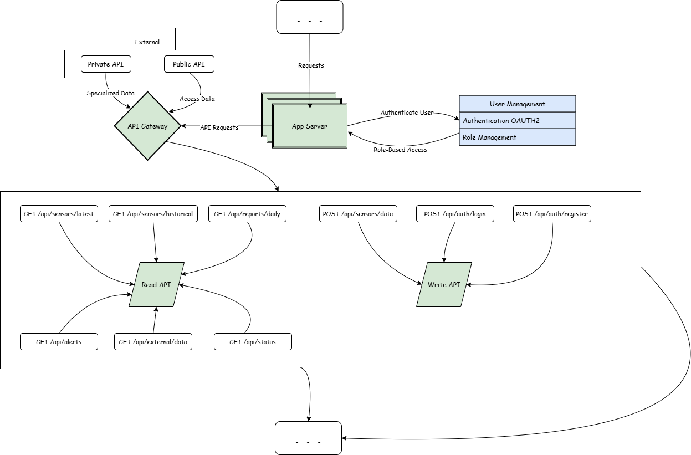

# Water Quality Monitoring Platform - System Documentation

## Table of Contents

1. [Overview](#overview)
2. [High-Level Architecture](#high-level-architecture)
3. [System Design Considerations & Scalability Strategies](#system-design-considerations--scalability-strategies)
4. [Data Flow](#data-flow)
5. [API Structure, Rate Limiting & Load Management](#api-structure-rate-limiting--load-management)
6. [Security & Authentication](#security--authentication)
7. [Integrating IoT Sensors and External APIs for Data Aggregation & Endpoints](#integrating-iot-sensors-and-external-apis-for-data-aggregation--endpoints)
8. [Authentication & RBAC System Design](#authentication--rbac-system-design)
9. [Conclusion](#conclusion)

---

## Overview

### Introduction

The **Water Quality Monitoring Platform** is designed to track and analyze water quality in real-time across municipal, industrial, and natural water sources. By leveraging IoT sensors, data analytics, and AI, the system detects contaminants, monitors chemical levels, and provides actionable insights to ensure safe and sustainable water usage.

### Key Features

- **Real-Time Monitoring:** Data ingestion from **10 million IoT sensors**.
- **Contamination Detection:** AI-based models for identifying anomalies.
- **Automated Alerts:** Threshold breach notifications.
- **Predictive Analytics:** Maintenance forecasts and trend analysis.
- **External API Integrations:** Municipal, industrial, and environmental platform support.
- **Scalability & High Availability:** Robust distributed infrastructure with load balancing, caching, and asynchronous task processing.

---

## High-Level Architecture

### Ingress & API Management

- **IoT Sensors:** Deployed in various locations to collect water quality metrics.
- **DNS Load Balancers:** Distributes incoming requests from sensors.
- **Load Balancers:** Ensures efficient request distribution among backend servers.
- **API Gateway:** Manages external and internal API requests.
  - **Public API:** For external integrations (municipalities, industrial clients).
  - **Private API:** For internal services and secure data access.

### Core Services

- **App Server:** Manages authentication, API requests, and data ingestion.
- **Authentication & Role Management:** OAuth2-based user authentication with roles: `Operator`, `Scientist`, and `Admin`.
- **Write API:** Handles data ingestion from sensors and services.
- **Read API:** Fetches processed or raw data for users and external integrations.

### Message-Driven Processing

- **RabbitMQ Message Broker:** Ensures asynchronous task execution for background processing.
- **Worker Services:**
  - **Contamination Detection Service:** Analyzes incoming sensor data for contaminants.
  - **AI Model Inference Service:** Runs ML-based contamination prediction.
  - **Predictive Analytics Service:** Generates insights on water trends and maintenance.
  - **Notification Service:** Sends alerts for contamination and system failures.
  - **Report Generation Service:** Aggregates data and generates reports.
  - **Monitoring Service:** Tracks system health and resource utilization.

### Storage & Data Management

- **PostgreSQL Cluster:** Stores structured data (sensor readings, user activity logs).
- **Redis Cache:** Caches frequently accessed data for fast retrieval.
- **Object Storage (S3):** Stores historical sensor data and generated reports.

### User Access & Dashboards

- **CDN:** Distributes frontend assets and reduces latency.
- **Load Balancer:** Manages user requests to backend servers.
- **User Dashboard:** Provides real-time data visualization and alerts.

---

## System Design Considerations & Scalability Strategies

### Challenges & Solutions

| Component              | Challenge                                      | Solution Implemented |
|------------------------|----------------------------------------------|----------------------|
| **API Gateway**       | High volume of sensor requests (3 req/sec/sensor) | Implemented rate limiting at API Gateway level (max 3 req/sec/sensor) |
| **Load Balancers**    | 10M IoT sensors generating 30M requests/sec   | DNS Load Balancer + multiple backend LB instances to distribute traffic |
| **Message Queue (RabbitMQ)** | Handling 30M tasks/sec                   | Horizontal scaling of workers and clustering for high-throughput processing |
| **Database (PostgreSQL)** | High write throughput from sensor data    | Sharding and replication to support concurrent writes |
| **Object Storage (S3)** | Max 3,500 PUT / 5,500 GET req/sec per bucket | Used bucket partitioning and multi-part uploads to optimize scalability |
| **Task Queue (Celery Workers)** | 100,000 tasks/sec for background processing | RabbitMQ clustering and worker autoscaling to maintain efficiency |
| **Caching Strategy**  | Frequent queries increasing database load     | Redis caching for sensor metadata and contamination thresholds |
| **Latency Requirements** | AI model execution time must be <500ms      | Optimized ML inference service and preloaded models |

---

## Data Flow

1. **IoT Sensors** send real-time data → **Load Balancers** → **App Server**. IoT Sensors send real-time water quality data at an expected rate of 3 requests/sec per sensor. With 10M sensors, this results in 30M API requests per second, distributed across multiple Load Balancers before reaching the API Gateway.
2. **Write API** processes data → stores in **PostgreSQL** (structured) or **S3** (raw/historical).
3. **RabbitMQ** distributes tasks → **Worker Services** process data.
4. **Contamination Detection & AI Models** analyze data → results stored in **PostgreSQL**.
5. **Predictive Analytics & Reporting** generate insights → stored in **S3**.
6. **Notifications** sent via **Notification Service** if contamination is detected.
7. **User Dashboard** fetches data via **Read API** and displays live metrics.

---

## API Structure, Rate Limiting & Load Management

To efficiently manage **30M sensor requests per second**, the system employs **rate limiting, load balancing, and asynchronous processing**.

### API Gateway Rate Limiting Mechanism

- **Rate Limit Per Sensor** → Each IoT sensor is restricted to **3 requests per second**.
- **Exceeding the Limit** → Requests exceeding this rate receive an **HTTP 429 Too Many Requests** response.

#### Handling Excess Requests

- Sensors must **retry after a cooldown period** (e.g., **exponential backoff**).
- **Excess requests are not queued** to prevent API server overload.

### Rate Limiting Implementation

#### **Algorithm Used:**

- The system employs a **Token Bucket Algorithm** at the **API Gateway** level.
- Each sensor receives **3 tokens per second**, with each request consuming one token.
- If a sensor exceeds its token quota, it must wait until new tokens are available.

#### **API Gateway Enforces Rate Limits:**

- Implemented via **NGINX, Kong API Gateway, or AWS API Gateway**.
- Configured to automatically reject requests exceeding defined quotas.

### Load Balancing Strategy

- **DNS Load Balancer** distributes traffic across multiple **region-based Load Balancers**.
- **API Servers** are **horizontally scaled** to ensure **high availability and fault tolerance**.

### Asynchronous Processing (RabbitMQ)

- Instead of direct database writes, **sensor data ingestion is handled asynchronously**.
- **RabbitMQ queues** allow system elasticity, preventing sudden spikes from overloading the database.

---

## Security & Authentication

- **OAuth2 for user authentication.**
- **Role-based access control with Operator, Scientist, and Admin roles.**
- **API Gateway ensures secure access management.**

---

## Integrating IoT Sensors and External APIs for Data Aggregation & Endpoints

### 1. Connection to High-Level Architecture

This section is directly linked to the **Ingress & API Management** and **Data Processing Layer** in the **High-Level Components Architecture**.

**Relevant Components:**

- **IoT Sensors** → Source of real-time water quality data.
- **DNS Load Balancers** → Distributes requests across multiple load balancers.
- **Load Balancers** → Manages high-throughput request distribution.
- **API Gateway** → Entry point for sensor data ingestion and external API requests.
- **App Server** → Manages authentication, API routing, and request processing.
- **Write API** → Stores incoming sensor data into the system.
- **RabbitMQ Message Broker** → Handles asynchronous processing of sensor data.
- **External Integration APIs** → Enables municipalities, industries, and environmental organizations to interact with system data.

---

### 2. Breakdown of Data Aggregation Process

The data aggregation process involves ingesting, processing, storing, and making sensor data available via external APIs.

#### **2.1 Data Collection from IoT Sensors**

- **10 million IoT sensors** continuously send real-time water quality readings.
- **Metrics include:**
  - pH Levels (acidity/alkalinity)
  - Turbidity (water clarity)
  - Dissolved Oxygen (DO levels)
  - Temperature (°C/°F)
  - Contaminants (nitrates, phosphates, heavy metals)
- Sensors communicate with the API Gateway via **HTTP(S) or MQTT protocols**.

#### **2.2 Traffic Management & Load Balancing**

- **DNS Load Balancer** distributes incoming requests across multiple Load Balancers.
- **Load Balancers** forward requests to the App Server based on availability.

#### **2.3 Data Ingestion via API Gateway**

- The **API Gateway** acts as a **single entry point** for all API requests.
- It **validates incoming data**, checks authentication, and applies rate limiting.
  - **Public APIs:** Available for municipalities & industrial clients.
  - **Private APIs:** Used by internal services.
- **Authentication is managed via OAuth2-based authentication service.**

#### **2.4 Processing via App Server & Write API**

- The **App Server** routes valid requests to the **Write API**.
- The **Write API** pushes raw sensor data into **RabbitMQ** for asynchronous processing.

#### **2.5 Asynchronous Data Processing (Worker Services)**

Once sensor data enters **RabbitMQ**, it is distributed to multiple **Worker Services**:

- **Contamination Detection Service** → Detects anomalies using AI-based contamination models.
- **AI Model Inference Service** → Performs predictive analytics on sensor data.
- **Monitoring Service** → Tracks system health and potential failures.

#### **2.6 Data Storage & Caching**

After processing, data is **stored and cached** for efficiency:

- **Structured Data (PostgreSQL Cluster):** Processed sensor readings and user metadata.
- **Historical Data (Object Storage - S3):** Raw sensor data for long-term storage.
- **Frequently Accessed Data (Redis Cache):** Cached contamination thresholds and metadata for low-latency access.

#### **2.7 External API Integrations**

External systems (municipal water management, industrial plants, environmental monitoring organizations) fetch processed data using the **External Integration API**.

**APIs provide:**

- Water quality reports.
- Real-time contamination alerts.
- Historical sensor data retrieval.

---

### 3. API Endpoints for IoT Data Aggregation

#### **3.1 Sensor Data APIs (Ingestion & Retrieval)**

| Endpoint               | Method | Description                                 | Input Example | Output Example |
|------------------------|--------|---------------------------------------------|---------------|----------------|
| `/api/sensors/data`   | POST   | Ingest real-time data from IoT sensors.    | `{ "sensor_id": "123", "pH": 7.2, "temp": 15.4 }` | `{ "status": "success", "message": "Data received" }` |
| `/api/sensors/latest` | GET    | Fetch latest processed sensor readings.     | `{ "sensor_id": "123" }` | `{ "pH": 7.1, "temp": 15.2, "timestamp": "2025-01-28T12:00:00Z" }` |
| `/api/sensors/historical` | GET  | Retrieve raw historical data from S3.      | `{ "sensor_id": "123", "date": "2025-01-27" }` | CSV or JSON file of historical records. |

#### **3.2 Reports & Alerts APIs**

| Endpoint          | Method | Description                             | Input Example | Output Example |
|------------------|--------|----------------------------------------|---------------|----------------|
| `/api/reports/daily` | GET  | Fetch daily water quality reports.    | `{ "location": "NYC", "date": "2025-01-27" }` | JSON report summary. |
| `/api/alerts`    | GET    | Retrieve contamination detection alerts. | `{ "region": "East Coast" }` | List of active contamination alerts. |

#### **3.3 External Integration APIs**

| Endpoint         | Method | Description                                | Input Example | Output Example |
|-----------------|--------|--------------------------------------------|---------------|----------------|
| `/api/external/data` | GET | Allow municipalities & industries to access processed data. | `{ "entity_id": "municipal_123" }` | JSON formatted water quality data. |

#### **3.4 Authentication APIs**

| Endpoint         | Method | Description            | Input Example | Output Example |
|-----------------|--------|------------------------|---------------|----------------|
| `/api/auth/login` | POST | Authenticate users. | `{ "username": "user123", "password": "pass" }` | JWT Token |
| `/api/auth/register` | POST | Register new users. | `{ "username": "new_user", "email": "mail@example.com", "password": "securePass" }` | `{ "status": "success", "user_id": "12345" }` |

#### **3.5 System Monitoring API**

| Endpoint         | Method | Description            | Output Example |
|-----------------|--------|------------------------|----------------|
| `/api/status`   | GET    | Check API health status. | `{ "status": "healthy", "db": "connected", "workers": "running" }` |

---

## Authentication & RBAC System Design

### **Requirements**

- User authentication via OAuth2
- Role-based access control (Operator, Scientist, Admin)
- Session management
- User profile management
- Secure password storage and transmission

---

  

## **Flow Overview**

### **1. User Request Initiation**

- A **user** makes an API request to access a service.
- The request is first routed through the **API Gateway**.
- The **API Gateway** forwards the request to the **App Server** for authentication.

### **2. OAuth2 Authentication**

- The **App Server** communicates with the **OAuth2 Authentication Service** to verify user credentials.
- If credentials are **valid**, token validation begins.

### **3. Token Validation**

#### **Does the User Have an Access Token?**

- **Yes → Check if the token has expired.**
- **No → Check for a refresh token.**

#### **Has the Access Token Expired?**

- **No → Proceed to role validation.**
- **Yes → Check if a refresh token exists.**

### **4. Refresh Token Handling**

- If the access token has expired, the system checks for a **refresh token**:
  - **Valid Refresh Token?**
    - **Yes → Generate a new access token.**
    - **No → 401 Unauthorized (User must log in again).**
  - If the **refresh token itself is expired**, the user must **re-authenticate**.

### **5. Role-Based Access Control (RBAC)**

- If the access token is valid, the system checks the **user’s role**:
  - **Valid Role → Access Granted.**
  - **Invalid Role → 403 Forbidden.**

### **6. Accessing System Services**

- If access is granted, the user is redirected to the appropriate system service:
  - **Admins:** Manage Users & Reports
  - **Scientists:** View Analytics & Water Data
  - **Operators:** Access Dashboard & Notifications
  - Other connected services include:
    - **RabbitMQ (Message Broker)**
    - **Notification Service**
    - **Predictive Analytics Service**
    - **Monitoring Service**
    - **PostgreSQL Database & Redis Cache**

---

## **Error Handling**

| Condition | Response Code | Action Required |
|-----------|--------------|----------------|
| Invalid credentials | `401 Unauthorized` | User must log in again |
| No access/refresh token | `401 Unauthorized` | User must re-authenticate |
| Expired refresh token | `401 Unauthorized` | User must log in again |
| Invalid role | `403 Forbidden` | Access denied |

---

## **Technologies Used**

- **OAuth2** for secure authentication
- **API Gateway** for request routing
- **PostgreSQL & Redis** for token storage and caching
- **RabbitMQ** for message brokering

---

## **Calculations**

### **Constraints**

- Support **1 million active users**
- Authentication response time **< 200ms**
- Token validation **< 50ms**
- **99.99% availability**

### **Capacity Planning**

- **Daily active users:** 1M
- **Peak concurrent users:** 100K
- **Average session duration:** 8 hours
- **Token size:** ~1KB
- **User profile size:** ~2KB

### **Data Storage**

1. **User Store (PostgreSQL)**
    - User profiles
    - Authentication data
    - Scaling: Read replicas
    - Size: ~3GB (**1M users × 3KB**)
2. **Session Store (Redis)**
    - Active sessions
    - Token blacklist
    - Scaling: Redis cluster
    - Size: ~100MB (**100K sessions × 1KB**)

---

## **Scale & Performance**

### **Scalability**

- **Horizontal scaling** of Authentication service
- **Redis cluster** for session management
- **Database read replicas** for distributed workload

---

## Conclusion

This architecture ensures a **highly scalable, resilient, and efficient system** for water quality monitoring, addressing performance limits, security concerns, and data availability while providing actionable insights in real-time.
